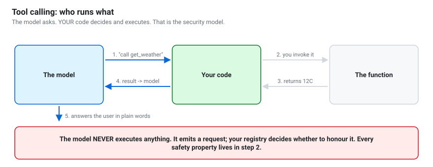

# Day 2 — From toy to component
{: .no_toc }

**Goal:** by this evening, the model runs as a service and returns data your
program can trust.

1. TOC
{:toc}

---

No GPU? Every notebook below opens in [Google Colab](../guides/colab.html) with one click.

## Schedule

| Time | Activity | Notebook |
|---|---|---|
| 0:00–0:15 | Recap; compare day-1 tokens/second across the room | — |
| 0:15–1:15 | Quantization; GGUF; Ollama and llama.cpp | `05_quantization_and_local_runtimes` |
| 1:15–2:15 | Serving over an OpenAI-compatible API | `06_serving_and_openai_api` |
| 2:15–2:30 | *Break* | — |
| 2:30–4:00 | Structured output: JSON, Pydantic, constrained decoding | `07_structured_output_and_tools` |
| 4:00–5:15 | Tool calling; writing safe tools | `07` (second half) |
| 5:15–6:00 | Lab: build three tools for your capstone idea | — |

## The one idea

> A model that returns prose is a demo. A model that returns **validated data**
> and **calls your functions** is a software component.

Today is the day the technology stops being a chatbot.



## What to pay attention to

**In notebook 05**, the quantization error table. The jump from 8-bit (~0.6%
error) to 4-bit (~11%) to 2-bit (~70%) explains every rule of thumb you will
hear about quant levels. And remember the headline: *a bigger model at Q4 beats
a smaller model at Q8.*

**In notebook 06**, the fact that the official OpenAI SDK talks to your laptop.
That portability is why you should never write application code against a
specific model's Python API.

**In notebook 07**, two things:
- the `finish_reason == "length"` demonstration — truncated output that looks
  complete is a bug you will meet in production;
- the letter-counting comparison. Tools beat prompting, measurably and
  permanently. *Do not fine-tune a model to do arithmetic; give it a calculator.*

## Set up Ollama today

Almost everything from here on assumes a running local server. Ollama is the
least painful:

```bash
# macOS / Linux
curl -fsSL https://ollama.com/install.sh | sh

# then
ollama pull qwen3:0.6b
ollama pull qwen3:4b       # if you have 8 GB+ of RAM to spare
ollama serve               # usually already running
```

Verify with `python -c "from qwen_workshop.client import is_up; print(is_up('ollama'))"`.

## Security starts today

The moment the model can trigger code, everything it reads becomes potentially
hostile input. Notebook 07 states the rules; they are not optional:

1. **Never `eval()` or `exec()` model output.** Not even for a demo.
2. **Never build SQL or shell commands** from model output.
3. **Allow-list**, never deny-list.
4. **Constrain the blast radius** — one directory, one domain, read-only by default.
5. **Confirm irreversible actions** with a human.
6. **Treat retrieved text as data, never instructions.**

{: .warning }
> Read rule 1 again. Every LLM tutorial that uses `eval()` for a "calculator
> tool" is teaching you to build a remote code execution vulnerability. The
> workshop's `calculate` tool parses an AST and permits only arithmetic nodes —
> look at `src/qwen_workshop/demo_tools.py` to see how.

## Checkpoint

1. What does 4-bit quantization store for each group of weights?
2. What do `K` and `M` mean in `Q4_K_M`?
3. Why does the OpenAI SDK work against a local server?
4. What are the three techniques for getting reliable JSON, in order of strength?
5. In the tool-calling flow, which step executes the function — and why does
   that matter for security?
6. Name three rules for writing a safe tool.

## Homework (30 minutes, genuinely worth it)

Decide your capstone project tonight, and write down three tools it needs. Give
each one a name, a one-line description, and its arguments. You will build them
on day 4, and having them in mind makes days 3 and 4 far more focused.

[Capstone ideas](../guides/capstone-ideas.html) if you need a starting point.

## Background reading

[The tool ecosystem](../handbook/the-tool-ecosystem.html) — the handbook chapter behind today's material.
