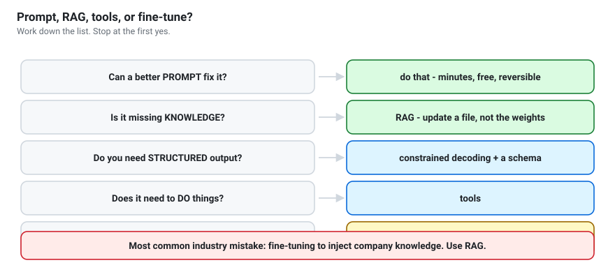

# Day 4 — Fine-tune, measure, ship
{: .no_toc }

**Goal:** by this evening, you have built, measured and presented something you
would actually use.

1. TOC
{:toc}

---

No GPU? Every notebook below opens in [Google Colab](../guides/colab.html) with one click.

## Schedule

| Time | Activity | Notebook |
|---|---|---|
| 0:00–1:30 | LoRA fine-tuning — and when not to | `11_finetuning_lora` |
| 1:30–2:00 | Capstone briefing; pick your project | `12_capstone_daily_assistant` |
| 2:00–4:30 | **Build.** Instructors circulate. | `12` |
| 4:30–5:00 | Evaluate: at least 10 test cases, scored | `12` |
| 5:00–6:00 | Demos — 5 minutes each | — |

## The one idea

> Anyone can demo an LLM. The engineering is in **measuring** it and being
> honest about where it fails.

## Fine-tuning: decide before you train

Work down this list and **stop at the first yes**:

1. Can a better **prompt** fix it? → do that.
2. Is the problem **missing knowledge**? → **RAG**.
3. Do you need **structured output**? → constrained decoding.
4. Does it need to **do things**? → tools.
5. Do you need a consistent **style or format** that prompting cannot hold? →
   **now** fine-tune.

{: .warning }
> The most common mistake in industry is fine-tuning to inject company
> knowledge. It half-works, cannot cite sources, and must be redone every time
> a document changes. Use RAG.

If you have no GPU, open notebook 11 in Colab, or read it through and run only
the data-preparation sections. Understanding *when* to fine-tune matters more
than having run a training loop once.

## Capstone requirements

All four are required:

| # | Requirement | Evidence |
|---|---|---|
| 1 | A local open-weight model | it runs with no API key |
| 2 | ≥3 tools, or RAG over your own documents | schemas or an index |
| 3 | An agent loop or an explicit chain | a trace of a multi-step run |
| 4 | An honest evaluation | ≥10 test cases, with a score |

Plus a README: what it does, how to run it, **what it gets wrong**, and what
you would do next.

### What earns marks

- **It runs.** A working demo beats an elegant design that does not.
- **You measured it.** A humble number beats "it seems good".
- **You know its limits.** Naming a real failure scores higher than hiding it.
- **Sensible engineering.** Validated tools, a step limit, no `eval`.

### What does not earn marks

Model size, framework choice, UI polish, or the number of features you crammed in.

## Presenting (5 minutes)

1. **The problem** (30s) — something the room recognises.
2. **Live demo** (2m) — run it. Record a backup in case the wifi dies.
3. **How it works** (1m) — one diagram: model, tools, loop.
4. **Your numbers** (1m) — the evaluation, including what failed.
5. **Honest limits** (30s) — what you would not trust it with.

Point 5 is what distinguishes an engineer from a demo.

## Checkpoint

1. Give the five-step decision list before fine-tuning.
2. What does LoRA learn, and why is it so much cheaper than full fine-tuning?
3. How would you detect catastrophic forgetting?
4. What is in your capstone evaluation, and what did it score?
5. Name three things your capstone gets wrong.

## After the workshop

You now have the foundations. [Where next](../guides/where-next.html) has the
paths forward — multimodal models, MCP, better retrieval, evaluation at scale.

The most valuable habit to keep: **read the model cards and technical reports.**
They are more accurate and more current than any tutorial, including this one.
