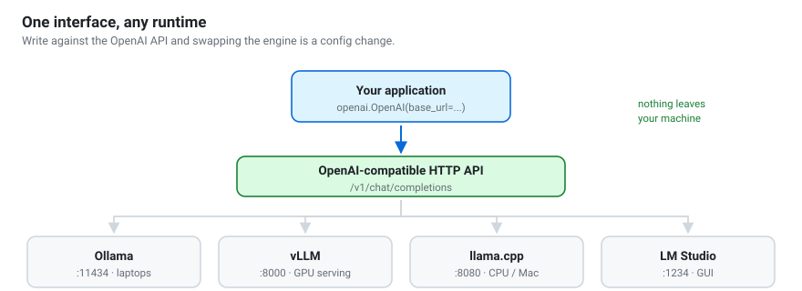

# From notebook to service
{: .no_toc }

1. TOC
{:toc}

---



## Choosing a runtime

| Runtime | Throughput | Setup | Choose when |
|---|---|---|---|
| **transformers** | low | trivial | Experimenting or fine-tuning |
| **Ollama** | moderate | trivial | One user, one machine, minimum friction |
| **llama.cpp server** | moderate | easy | CPU or Apple Silicon, or you need quant control |
| **vLLM** | **high** | moderate, needs a GPU | Serving many users or an application |
| **TGI / SGLang** | high | moderate | Alternatives to vLLM with different trade-offs |

For a class or a small app on one GPU, **vLLM**. For a personal assistant on a
laptop, **Ollama**.

## A minimal vLLM deployment

```bash
pip install vllm

vllm serve Qwen/Qwen3-8B \
  --max-model-len 8192 \
  --gpu-memory-utilization 0.90 \
  --enable-auto-tool-choice \
  --tool-call-parser hermes \
  --port 8000
```

| Flag | Why it matters |
|---|---|
| `--max-model-len` | Caps the KV cache. Without it, one long conversation can exhaust VRAM. |
| `--gpu-memory-utilization` | Leave headroom; 0.90 is a sensible default. |
| `--enable-auto-tool-choice` | Required for structured `tool_calls` in responses. |
| `--tool-call-parser hermes` | The format Qwen3 emits. |
| `--quantization awq` | For quantized weights. |
| `--tensor-parallel-size N` | Split across N GPUs. |

Health check: `curl http://localhost:8000/v1/models`.

## Your application code should not care

Write against the OpenAI interface and the runtime becomes a configuration
value:

```python
from openai import OpenAI

client = OpenAI(
    base_url=os.environ.get("LLM_BASE_URL", "http://localhost:11434/v1"),
    api_key=os.environ.get("LLM_API_KEY", "not-needed"),
)
```

Develop against Ollama on your laptop, deploy against vLLM on the server,
change one environment variable.

## The hardening checklist

Before anyone else can reach your endpoint:

- [ ] **Do not bind to `0.0.0.0`** unless you mean it. Default to localhost and
      put a reverse proxy in front.
- [ ] **Authenticate.** An open LLM endpoint is free compute for whoever scans
      your IP range. Use an API key at the proxy, or mTLS.
- [ ] **Rate-limit** per client. Both requests/minute and tokens/minute.
- [ ] **Cap `max_tokens` server-side.** Otherwise one request runs for an hour.
- [ ] **Set `--max-model-len`.** See above.
- [ ] **Time out** every request, and handle the timeout in the client.
- [ ] **Pin versions** — model, runtime, tokenizer. Silent upgrades change outputs.
- [ ] **Monitor** latency, queue depth, GPU memory and error rate.
- [ ] **Decide your logging policy before you launch**, not after. Logging
      prompts is often the most sensitive thing your service does.

{: .warning }
> `--host 0.0.0.0` on a university network exposes your GPU to everyone on that
> network. This happens more often than it should.

## Capacity planning

Rough figures for one modern GPU serving an 8B model at int4, with vLLM:

| Concurrent users | Experience |
|---|---|
| 1–5 | Excellent, near-instant |
| 5–20 | Good, with continuous batching |
| 20–50 | Acceptable; queueing becomes visible |
| 50+ | Needs more GPUs, or a smaller model |

Throughput scales far better than latency. Batching many users is cheap;
making one user's answer faster is not.

## Caching

Two easy wins:

1. **Prompt caching.** vLLM's `--enable-prefix-caching` reuses the KV cache for
   shared prefixes. With a long system prompt, this is a large saving.
2. **Response caching.** For repeated identical questions (FAQs), a simple
   dictionary keyed on the normalised prompt avoids the model entirely. Set
   `temperature=0` so caching is sound.

## Containerising

```dockerfile
FROM vllm/vllm-openai:latest
ENV HF_HOME=/models
EXPOSE 8000
ENTRYPOINT ["vllm", "serve", "Qwen/Qwen3-8B", \
            "--max-model-len", "8192", "--host", "0.0.0.0"]
```

Mount the model cache as a volume so you do not re-download on every restart:

```bash
docker run --gpus all -p 8000:8000 -v $PWD/models:/models my-qwen-service
```

{: .note }
> `--host 0.0.0.0` is correct *inside* a container — the container boundary is
> your isolation. Control exposure with the port mapping and your firewall.

## Cost, honestly

A rough comparison for a workload of 1M tokens/day:

| Option | Rough cost | Other considerations |
|---|---|---|
| Hosted frontier API | highest per token | zero ops, best quality |
| Hosted open-weight API | moderate | no ops, good quality |
| Your own GPU (cloud) | moderate, fixed | you run it; idle time is wasted |
| Your own GPU (owned) | electricity | capital cost; you run it |

Self-hosting wins on **high volume**, **privacy requirements**, and **predictable
load**. It loses on spiky traffic and when you have no one to operate it. Do the
arithmetic for your actual volume before assuming either way.
