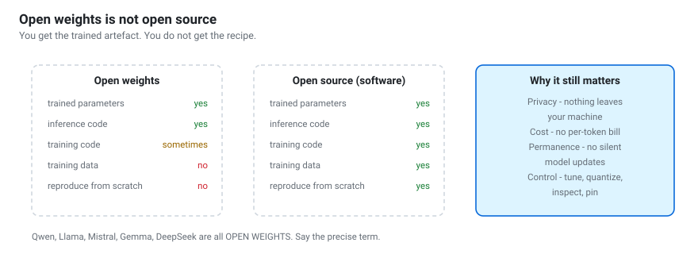
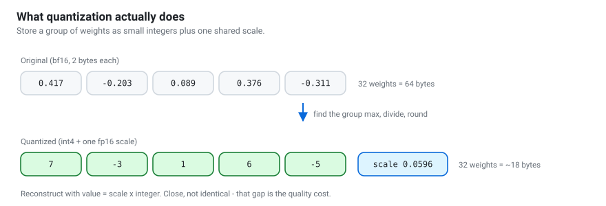
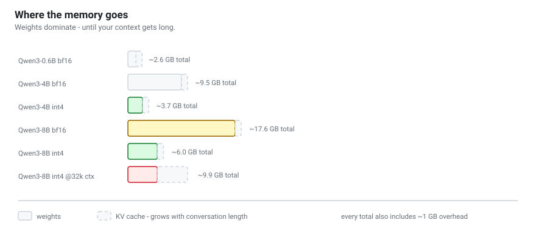

# Open-weight models — the full picture
{: .no_toc }

What "open weights" actually means, what you are allowed to do with them, where
to get them, and how to choose.

1. TOC
{:toc}

---



## 1. Open weights vs. open source

These are not the same thing, and the difference is legal as well as technical.

| | Open weights | Open source (software sense) |
|---|---|---|
| Trained parameters | ✅ published | ✅ |
| Inference code | ✅ usually | ✅ |
| Training code | sometimes | ✅ |
| **Training data** | almost never | ✅ |
| Run offline, unmodified | ✅ | ✅ |
| Fine-tune and redistribute | licence-dependent | ✅ |
| Reproduce from scratch | ❌ | ✅ |

Nearly every "open" LLM — Qwen, Llama, Mistral, Gemma, DeepSeek, Phi — is
**open weights**. You get the trained artefact, not the recipe. You can use and
adapt it; you cannot rebuild it.

The Open Source Initiative published an [Open Source AI
Definition](https://opensource.org/ai) in 2024 arguing that "open source AI"
should require data transparency. Almost no major model meets it. Prefer the
precise term: say *open weights*.

Genuinely data-open models do exist — OLMo (AI2), Pythia (EleutherAI) — and are
valuable for research. They are generally not the most capable models available.

---

## 2. Why it matters

### Privacy

Your prompt never leaves your machine. This is not an abstract benefit:

- Medical, legal or financial questions about real people.
- Company documents under NDA.
- Student work, exam material, personal notes.
- Anything in a jurisdiction with data-residency rules.

In the workshop you point RAG at your own notes (notebook 09). That is only
reasonable *because* the model is local.

### Cost

No per-token billing. After the download, the cost is electricity. For
high-volume, low-complexity work — classification, extraction, summarisation of
millions of records — a local 4B model is often cheaper by orders of magnitude
than an API, and the economics get better every hardware generation.

### Availability and permanence

No rate limits, no outages, no deprecation. The model you built on in March
behaves identically in December, because it is a file on your disk. Anyone who
has had a hosted model silently updated underneath a production prompt
understands why this matters.

### Control

You can fine-tune it, quantize it, inspect its activations, pin a version
forever, and run it on an air-gapped machine.

### The honest trade-off

Open-weight models you can run on a laptop **are less capable** than the largest
hosted models. A 4B model is not going to match a frontier system on hard
reasoning. Much of this workshop is about closing that gap with retrieval, tools
and structure rather than raw model size — and about measuring honestly whether
you have closed it.

---

## 3. Licences: read them

"Open weights" says nothing about what you may do. Check the model card.

| Licence | Examples | Commercial use | Notes |
|---|---|---|---|
| **Apache 2.0** | Qwen3 (main line), Mistral 7B, OLMo | ✅ yes | Permissive. Patent grant. The safest default. |
| **MIT** | Phi-3, some DeepSeek | ✅ yes | Permissive. |
| **Llama Community** | Llama 3.x | ✅ with conditions | Extra terms above 700M monthly users; naming requirements. |
| **Gemma Terms** | Gemma 2/3 | ✅ with conditions | Use-restriction policy attached. |
| **Qwen Research** | some older/larger Qwen sizes | ❌ research only | Check the specific model card. |
| **Non-commercial** | various | ❌ | Fine for coursework, not for a product. |

Four things people get wrong:

1. **The licence covers outputs too, sometimes.** Some licences make claims
   about generated content. Apache 2.0 does not.
2. **Fine-tuned derivatives inherit obligations.** Your LoRA adapter on a
   restricted base is still restricted.
3. **Different sizes in one family can have different licences.** Do not assume.
4. **"Open" in a blog post is marketing.** The `LICENSE` file is the fact.

{: .note }
> The Qwen3 dense and MoE models are released under **Apache 2.0**, which is a
> large part of why this workshop uses them: students can build on them
> commercially without legal homework. Still confirm on the model card for the
> specific checkpoint you download — families change.

---

## 4. Where to get them

| Source | Best for | How |
|---|---|---|
| **Hugging Face Hub** | The default. Every format. | `huggingface-cli download Qwen/Qwen3-4B` |
| **ModelScope** | Faster inside mainland China | `modelscope download --model Qwen/Qwen3-4B` |
| **HF mirror** | When HF is slow or blocked | `export HF_ENDPOINT=https://hf-mirror.com` |
| **Ollama** | One-command local chat | `ollama pull qwen3:4b` |
| **Kaggle Models** | Sometimes available in restricted networks | web download |

### What is in a model repo

```
config.json                architecture and hyperparameters
model.safetensors          the weights          <- the big file
model.safetensors.index.json   shard map, for models split across files
tokenizer.json             the vocabulary
tokenizer_config.json      includes the chat template
generation_config.json     the author's recommended sampling defaults
README.md                  the model card: licence, benchmarks, usage
```

{: .warning }
> **Always prefer `.safetensors` over `.bin`.** The legacy PyTorch `.bin` format
> is a Python pickle: loading it executes arbitrary code from whoever uploaded
> it. `safetensors` is pure data and cannot execute anything. Treat a repo that
> only ships `.bin` with suspicion.

### Evaluating a repo before you download 16 GB

- **Downloads and likes** — a proxy for whether anyone has verified it works.
- **The organisation** — `Qwen/...` is the official account. `randomuser/Qwen3-4B-v2-BEST`
  is not.
- **The model card** — a real one states the licence, the training approach,
  benchmarks and known limitations. A one-line card is a warning sign.
- **Community tab** — where people report that it is broken.

---

## 5. Formats

| Format | Extension | Runtime | Use when |
|---|---|---|---|
| **Safetensors** | `.safetensors` | transformers, vLLM | GPU inference, fine-tuning |
| **GGUF** | `.gguf` | llama.cpp, Ollama, LM Studio | CPU, Apple Silicon, laptops |
| **AWQ / GPTQ** | safetensors + config | vLLM, transformers | Quantized GPU serving |
| **MLX** | `.safetensors` (MLX layout) | mlx-lm | Apple Silicon, native |
| **ONNX** | `.onnx` | ONNX Runtime | Embedded, cross-platform, browsers |

The practical rule: **GGUF if it runs mostly on CPU, safetensors if it runs on a
GPU.** Everything else is a special case.

---



## 6. Quantization in one page

Quantization stores each weight in fewer bits. The model gets smaller and
faster to load; it also gets slightly worse.

| Precision | Bytes/param | 8B model | Quality |
|---|---|---|---|
| fp32 | 4 | 32 GB | reference |
| **bf16 / fp16** | 2 | 16 GB | the standard; no visible loss |
| int8 | 1 | 8 GB | very close to bf16 |
| **int4** (Q4_K_M, NF4, AWQ) | ~0.55 | ~4.5 GB | small but real loss; usually worth it |
| int3 | ~0.45 | ~3.5 GB | noticeable degradation |
| int2 | ~0.35 | ~3 GB | usually not worth it |

### GGUF quant names

`Qwen3-8B-Q4_K_M.gguf` decodes as:

- `Q4` — 4-bit payload
- `K` — "k-quants", which spend more bits on the layers that matter most
- `M` — the medium variant of that mix (`S` smaller, `L` larger)

**Start with `Q4_K_M`.** It is the consensus default for good reason. Move to
`Q5_K_M` or `Q6_K` if you have the memory and care about quality; drop to `Q3`
only when you must.

{: .tip }
> **A larger model at Q4 beats a smaller model at Q8** at the same file size.
> Qwen3-8B-Q4_K_M generally outperforms Qwen3-4B-Q8_0. When in doubt, go bigger
> and quantize harder.

Notebook 05 implements group-wise quantization in 15 lines of NumPy so you can
see exactly where the error comes from.

---



## 7. Sizing: what fits on what

Memory ≈ weights + KV cache + ~1 GB overhead.

| Your hardware | Comfortable model | Notes |
|---|---|---|
| 8 GB RAM, no GPU | Qwen3-0.6B / 1.7B (Q4) | 8–20 tok/s. Fine for learning. |
| 16 GB RAM, no GPU | Qwen3-4B (Q4) | 3–6 tok/s. Usable with streaming. |
| Apple Silicon 16 GB | Qwen3-4B / 8B (Q4, MLX or GGUF) | Unified memory is a real advantage. |
| 8 GB VRAM | Qwen3-8B (int4) | 20–40 tok/s. |
| 16 GB VRAM (T4, 4080) | Qwen3-14B (int4) or 8B (bf16) | Comfortable. |
| 24 GB VRAM (3090, 4090) | Qwen3-30B-A3B (Q4) | MoE: 30B memory, ~3B speed. |
| Free Colab T4 | Qwen3-4B / 8B (int4) | Everything in this workshop. |

The KV cache is the part people forget: it grows with conversation length, and
at 32k context it can exceed the weights. Notebook 02 computes it properly.

---

## 8. The landscape beyond Qwen

Worth knowing, even though this workshop is Qwen-based.

| Family | Who | Character | Licence |
|---|---|---|---|
| **Qwen** | Alibaba | Strong all-round, excellent multilingual, wide size range | Apache 2.0 (main line) |
| **Llama** | Meta | Huge ecosystem, most tooling targets it first | Community licence |
| **Mistral / Mixtral** | Mistral AI | Efficient, strong European-language support | Apache 2.0 (some) |
| **Gemma** | Google | Small sizes, good quality-per-parameter | Gemma terms |
| **DeepSeek** | DeepSeek | Strong reasoning and code | MIT (some) |
| **Phi** | Microsoft | Very small, trained on curated data | MIT |
| **OLMo** | AI2 | Fully open including data | Apache 2.0 |

**Why Qwen for this workshop:** Apache 2.0 on the main line, sizes from 0.6B to
hundreds of billions with a consistent API, genuinely strong multilingual
performance including Russian and reasonable Kazakh, a hybrid thinking mode that
makes reasoning visible, and matching embedding and reranker models. It is also
a rare family where the *small* models are good, which matters when your
students have laptops.

See [The Qwen family](qwen-family.html) for which specific model to pick.

---

## 9. Staying current

This field moves faster than any tutorial can. The habits that keep you current:

1. **Read model cards, not blog posts.** The card states the licence, the
   context length and the recommended sampling settings. The blog post is marketing.
2. **Read the technical reports.** Qwen, DeepSeek and OLMo all publish substantial
   ones. An hour with a technical report beats a week of tutorials.
3. **Watch the leaderboards sceptically.** [LMArena](https://lmarena.ai) is
   human preference, which is useful and gameable. Benchmark scores leak into
   training data. Your own evaluation on your own task is worth more than both.
4. **Test on your task.** Ten of your own examples tell you more about whether a
   model fits your problem than any benchmark table.

{: .note }
> Anything specific in this guide — model names, sizes, licences — is a snapshot
> from when the workshop was written. The *reasoning* should outlast it. Always
> verify specifics against the model card.
