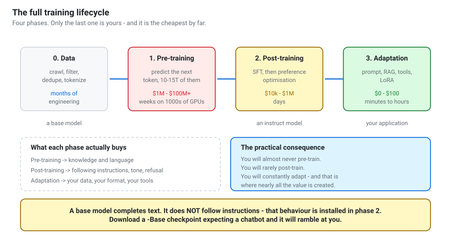
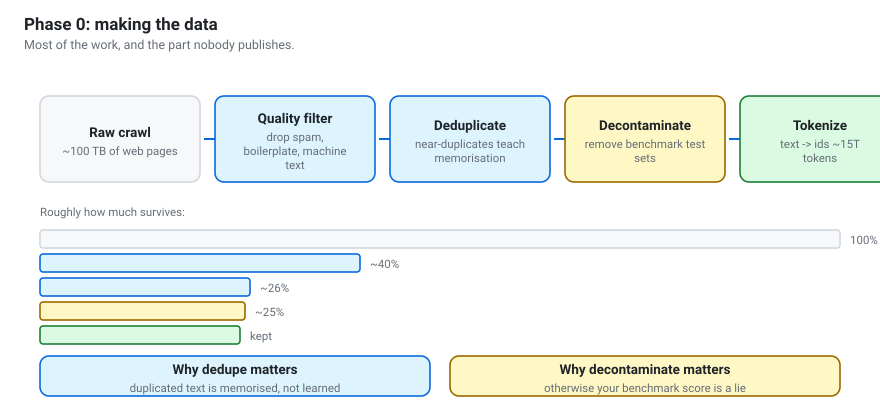
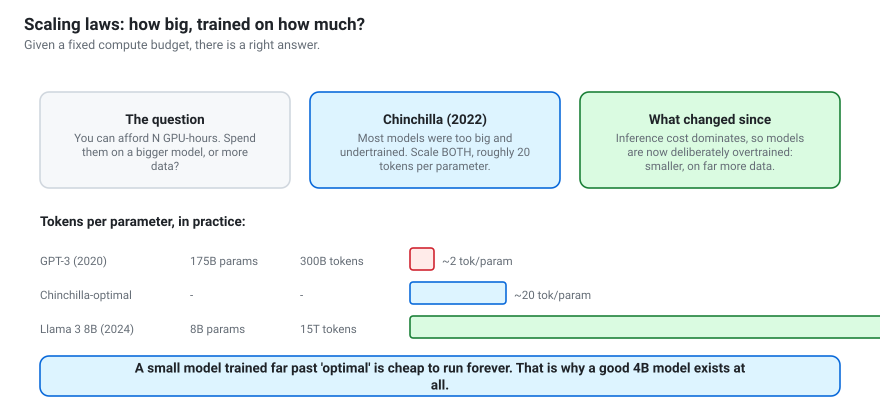
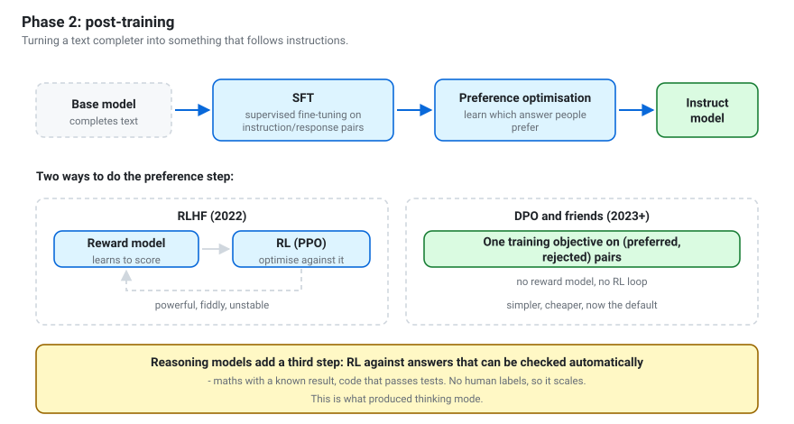
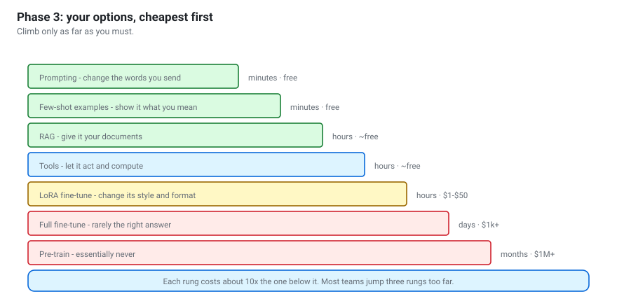
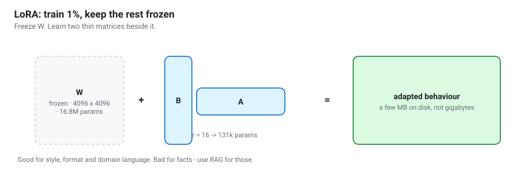
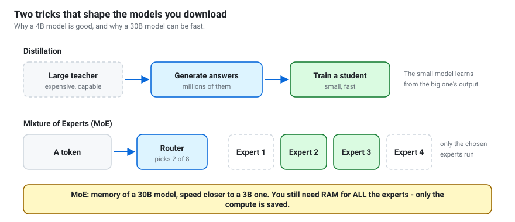

# How LLMs are trained
{: .no_toc }

Every phase, from raw web pages to the model you download — and where your own
work fits in.

1. TOC
{:toc}

---



## The shape of it

Four phases, and they answer different questions:

| Phase | Question it answers | Who does it | Rough cost |
|---|---|---|---|
| **0. Data** | What should it read? | Labs | months of engineering |
| **1. Pre-training** | What does it know? | Labs | $1M – $100M+ |
| **2. Post-training** | How does it behave? | Labs, sometimes you | $10k – $1M |
| **3. Adaptation** | How does it serve *my* problem? | **You** | $0 – $100 |

Each phase costs roughly 100× less than the one before. You will spend your
career in phase 3 — but understanding 0–2 is what lets you predict what a model
will and will not do.

{: .note }
> **The single most useful thing in this chapter:** pre-training installs
> *knowledge*, post-training installs *behaviour*. Almost every "why is the
> model doing this?" question resolves to which phase is responsible.

---

## Phase 0 — Building the dataset

The least glamorous phase, the largest share of the work, and the part almost
nobody publishes in full.



### Where the text comes from

- **Web crawl** (Common Crawl and similar) — the bulk, and the worst quality.
- **Curated text** — books, Wikipedia, academic papers, high-quality forums.
- **Code** — GitHub and similar. Code improves *reasoning* generally, not just
  coding, which is a genuinely surprising empirical result.
- **Synthetic data** — text generated by another model, increasingly common,
  especially for instruction and reasoning data.

### The pipeline

1. **Extract** readable text from HTML, discarding navigation and boilerplate.
2. **Filter for quality** — language detection, heuristics (too short,
   too repetitive, wrong punctuation profile), and classifiers trained to
   recognise "text that looks like a book".
3. **Deduplicate.** Critical and underappreciated. Duplicated passages get
   **memorised** rather than learned, wasting capacity and worsening
   regurgitation of training data.
4. **Decontaminate** — remove benchmark test sets. Skip this and your reported
   scores are meaningless, because the model has seen the answers.
5. **Tokenize** into the final integer stream.

Roughly a quarter of the starting text survives. Modern runs use **10–15
trillion tokens** — hundreds of times more than a human reads in a lifetime.

### Why this matters to you

- **Knowledge cutoff.** The model knows nothing after its data was collected.
- **Language coverage.** If Kazakh was 0.01% of the data, expect Kazakh
  performance to reflect that.
- **Inherited bias.** The model reflects the text it read, including its
  prejudices.
- **Nobody can fully audit it.** This is precisely the gap between "open
  weights" and "open source" — you get the result, not the ingredients.

---

## Phase 1 — Pre-training

### The objective is startlingly simple

Take a sequence. Hide what comes next. Predict it. Compare with the truth.
Adjust the weights. Repeat, trillions of times.

That is the entire objective: **next-token prediction**. No labels, no human
annotation — the text supplies its own answer, which is what makes the scale
possible.

### Why this produces knowledge

To predict the next token well across trillions of tokens, a model is forced to
internalise structure:

- To finish "The capital of Kazakhstan is ___" it needs geography.
- To finish "if x = 3, then 2x + 1 = ___" it needs arithmetic.
- To finish a function body it needs programming semantics.

Knowledge is a **side effect** of compression. Nobody taught it facts; facts
were the cheapest way to lower the loss.

### Scaling laws: the budget question



Given a fixed compute budget, should you train a bigger model or feed it more
data? The [Chinchilla paper](https://arxiv.org/abs/2203.15556) (2022) found that
models of the era were **too large and undertrained**, and that roughly **20
tokens per parameter** was compute-optimal.

Then the economics shifted. A model is trained once and served billions of
times, so **inference cost dominates**. Modern small models are deliberately
trained far past "optimal" — Llama 3 8B saw around 15T tokens, close to 2,000
tokens per parameter.

**This is why a good 4B model exists at all**, and it is the single most
important reason this workshop is practical on student hardware.

### What it costs

| Model size | Rough compute | Rough cost |
|---|---|---|
| 1B | thousands of GPU-hours | $10k–$100k |
| 8B | tens of thousands | $100k–$1M |
| 70B | hundreds of thousands | $1M–$10M |
| 400B+ | millions | $10M–$100M+ |

Plus a cluster of thousands of GPUs, an interconnect fast enough to keep them
busy, and engineers who can keep a weeks-long run from dying. **You will not do
this**, and that is fine — it is exactly why open weights matter.

### What comes out: a base model

A **base model** completes text. It does not follow instructions, has no chat
template, and has no notion of a "user". Ask it a question and it may well
continue with more questions.

{: .warning }
> If a "chat" model rambles and ignores you, check whether you downloaded a
> `-Base` checkpoint. This is a weekly occurrence for people new to the field.

---

## Phase 2 — Post-training

Taking a text completer and installing the behaviour of an assistant.



### Step 1: Supervised fine-tuning (SFT)

Train on curated **(instruction, good response)** pairs — typically tens of
thousands to a few million, written by humans, generated by stronger models, or
both.

Mechanically this is identical to pre-training: predict the next token. The
difference is entirely in the data. The model learns the *shape* of being
helpful: answer the question, use the chat format, stop when finished.

This is also exactly what notebook 11 does with LoRA, at a thousandth of the
scale.

### Step 2: Preference optimisation

SFT teaches one good answer. It does not teach which of two plausible answers
people actually prefer — more honest, better formatted, appropriately cautious.

#### RLHF (the original)

[InstructGPT](https://arxiv.org/abs/2203.02155), 2022:

1. Generate several responses to the same prompt.
2. **Humans rank them.**
3. Train a **reward model** to predict those rankings.
4. Use reinforcement learning (PPO) to optimise the language model against the
   reward model, with a penalty for drifting too far from the SFT model.

It works, and it is genuinely awkward: you are training two models, RL is
unstable, and the policy will **reward-hack** — finding outputs the reward model
loves and humans do not, like excessive hedging or flattery.

#### DPO and relatives (the simplification)

[Direct Preference Optimization](https://arxiv.org/abs/2305.18290), 2023, made
a sharp observation: given preference pairs, you can skip the reward model and
the RL loop entirely and optimise a single closed-form objective directly on
(preferred, rejected) pairs.

Far simpler, far more stable, far cheaper. Variants — ORPO, KTO, SimPO — trade
off data format and compute. **DPO-style methods are now the common default**,
and `trl` implements them in roughly the same number of lines as SFT.

#### RLAIF and Constitutional AI

Human preference labels are slow and expensive. If a model can judge outputs
against a written set of principles, it can generate preference data itself.
Anthropic's [Constitutional AI](https://arxiv.org/abs/2212.08073) is the
best-known version. It scales; it also means the model's values are shaped by
whoever wrote the principles.

### Step 3: Reasoning (the newest phase)

Preference data works for "which answer is nicer". It works badly for "which
chain of reasoning is correct", because humans are slow and unreliable at
grading long derivations.

The breakthrough was to use problems whose answers can be **checked
automatically**:

- maths with a known result,
- code that either passes tests or does not,
- puzzles with verifiable solutions.

Reinforcement learning against a *verifier* rather than a human needs no
labelling, so it scales. Models trained this way learn to generate long internal
reasoning before answering — and, notably, learn to backtrack and check
themselves, behaviours nobody explicitly demonstrated.

**This is what Qwen3's thinking mode is.** It is also why thinking mode helps
enormously on maths and logic and barely at all on translation: it was trained
on verifiable domains.

### Also in this phase

- **Safety tuning** — refusals for harmful requests. Same machinery, different data.
- **Long-context extension** — continued training on long documents.
- **Tool-use training** — teaching the `<tool_call>` format so function calling
  works at all.
- **Multilingual balancing** — extra data for under-represented languages.

### What comes out: an instruct model

`Qwen/Qwen3-8B` rather than `Qwen/Qwen3-8B-Base`. It follows instructions, has a
chat template, and will refuse some requests. **This is what you download.**

---

## Phase 3 — Adaptation: your part



Work **up** this ladder and stop at the first rung that solves your problem.
Each rung costs roughly 10× the one below.

| Rung | Changes | Use when |
|---|---|---|
| **Prompting** | nothing — just your words | always try first |
| **Few-shot** | nothing | format compliance |
| **RAG** | what's in the context | the model lacks *your* facts |
| **Tools** | what it can do | it needs to compute or act |
| **LoRA** | a small set of added weights | style or format prompting can't hold |
| **Full fine-tune** | all weights | rarely correct |
| **Pre-training** | everything | essentially never |

### Why RAG beats fine-tuning for facts

This is the most common expensive mistake in industry, so it is worth stating
plainly:

| | RAG | Fine-tuning |
|---|---|---|
| Add a fact | add a file, seconds | retrain |
| Remove a fact | delete a file | retrain, and hope |
| Cite a source | natural | impossible |
| Know if it's current | yes | no |

**Fine-tuning teaches a model how to speak. RAG tells it what to say.**

### LoRA: what it actually does



Full fine-tuning of an 8B model needs roughly 16 GB for weights, 16 GB for
gradients and 64 GB for optimiser state — about 96 GB. Not happening on your
laptop.

[LoRA](https://arxiv.org/abs/2106.09685) freezes the original weights `W` and
learns a small additive correction, expressed as the product of two thin
matrices `B` and `A`:

```
W' = W + (alpha / r) * B @ A

    W   is d x k   and frozen
    B   is d x r   trained
    A   is r x k   trained
    r   is the rank, and r << d
```

With rank `r = 16` you train well under 1% of the parameters. The adapter is a
few megabytes, you can keep dozens for different behaviours, and you remove one
by simply not loading it. **QLoRA** goes further, fine-tuning on top of a 4-bit
base so a 14B model fits on a 16 GB GPU.

> Notebook 11 walks through this end to end, including how to tell whether it
> helped.

---

## Post-processing: what happens after training

Two more transformations shape the file you actually download.



**Distillation.** A large "teacher" generates millions of responses; a small
"student" is trained on them. The student learns from the teacher's output
distribution and lands far above what it could reach training on raw text alone.
A large share of today's impressively good small models are distilled.

**Mixture of Experts.** Replace the feed-forward layer with many "experts" and a
router that sends each token to a couple of them. Qwen3-30B-A3B has 30B total
parameters but activates about 3B per token: the memory of a large model, the
speed of a small one. **You still need RAM for all the experts** — only compute
is saved.

**Quantization** is a third, covered in
[the open-weight models guide](../guides/open-weight-models.html#6-quantization-in-one-page)
and notebook 05.

---

## How anyone knows it worked

Each phase has its own measure, and confusing them causes real mistakes.

| Phase | Measured by | Watch out for |
|---|---|---|
| Pre-training | perplexity, benchmark suites | benchmark contamination |
| Post-training | human preference, instruction-following evals | graders preferring longer answers |
| Reasoning | verifiable accuracy (maths, code) | overfitting to one problem style |
| **Your adaptation** | **your own task, your own test set** | **not having one** |

**Public benchmarks are weak evidence for your decision.** They leak into
training data, they are gamed, and they measure a distribution that is not
yours. Ten examples from your real task tell you more than any leaderboard.

That is why every notebook in this workshop ends with a measurement.

---

## What to take away

1. **Pre-training = knowledge. Post-training = behaviour.** Diagnose accordingly.
2. **Base models do not follow instructions.** That is installed later.
3. **Scaling laws shifted** because inference cost dominates — which is why good
   small models exist.
4. **Preference optimisation got simple.** DPO removed the reward model and the
   RL loop.
5. **Reasoning came from verifiable rewards**, which is why thinking mode helps
   on maths and not on translation.
6. **You work in phase 3**, and almost all practical value is created there.
7. **Use RAG for facts, fine-tuning for form.** Reversing this is the classic
   expensive error.

---

**Next:** [The model landscape](the-model-landscape.html) — telling all these
model types apart.
