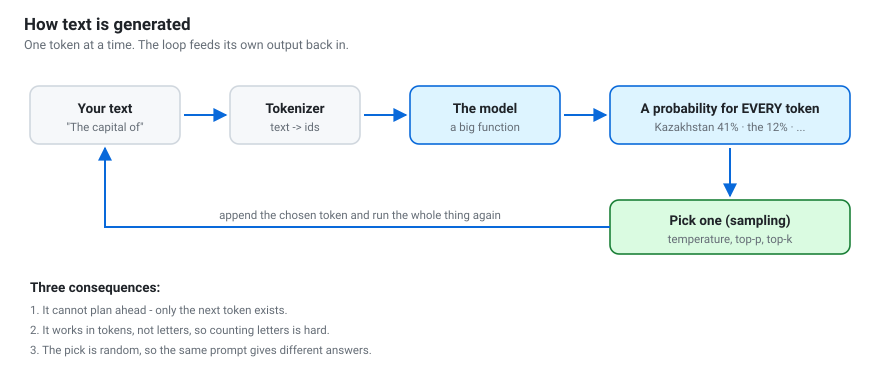
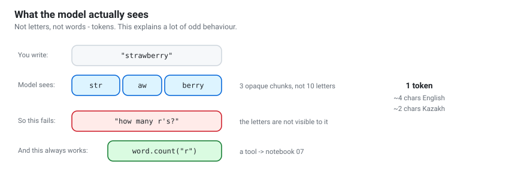
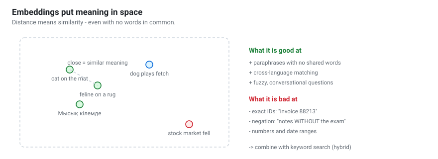
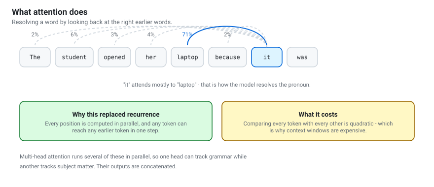
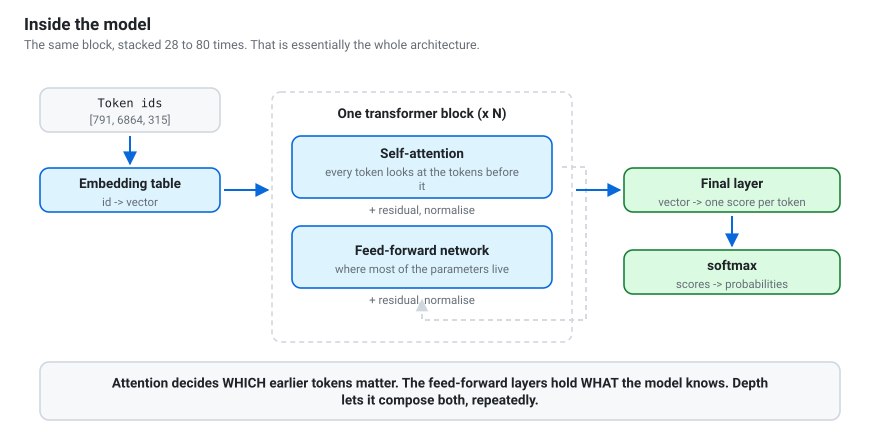
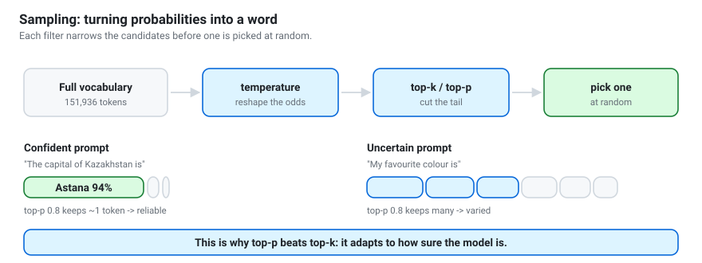

# How models work
{: .no_toc }

The mechanism, without a maths degree. Enough to reason about behaviour you
will actually encounter.

1. TOC
{:toc}

---

## The one-sentence version

> A language model takes a sequence of tokens and outputs a probability
> distribution over which token comes next.

Everything else — chat, reasoning, tool use, agents — is that operation applied
repeatedly, with structure around it.

## Tokens: the units that actually exist

A model does not see letters or words. It sees **tokens** — chunks of text from
a fixed vocabulary, typically 30,000–150,000 entries, learned from data so that
common sequences get their own token.

| Language | Characters per token (roughly) |
|---|---|
| English | ~4 |
| Code | ~3 |
| Russian | ~2 |
| Kazakh | ~2 |
| Chinese | ~1.5 |

This has consequences people rarely connect back to tokenization:

- **Letter counting fails.** "How many r's in strawberry" asks about characters
  inside opaque chunks. The fix is a tool, not a better model.
- **Non-English text costs more.** Same document, twice the tokens, twice the
  context and twice the price. This is a genuine fairness issue.
- **Numbers are fragile.** `1234567` may split unpredictably, which is part of
  why arithmetic is unreliable.
- **Rare names get shredded** into several tokens and are easier to garble.

> Notebook 01 has you measure all of this with the real Qwen tokenizer.

## Embeddings: turning tokens into meaning

Each token id is looked up in an **embedding table** and becomes a vector —
typically 1,000 to 8,000 numbers. Training arranges these so that vectors
encode meaning: similar words end up near each other.

This is the same machinery behind semantic search in notebook 08. The
difference is that a chat model embeds tokens as an internal step, while an
*embedding model* is trained to produce one vector for a whole passage.

## Attention: looking at the right earlier words

Attention is what lets the model resolve *"she opened her laptop because **it**
was slow"* — it must connect "it" to "laptop", eight tokens back.

For each token, the model computes three vectors:

| | Intuition |
|---|---|
| **Query** | what this token is looking for |
| **Key** | what each earlier token offers |
| **Value** | the content it contributes if selected |

Compare each query with every key, turn the scores into weights with softmax,
and take a weighted sum of the values. Tokens that match get attended to.

**Multi-head** attention runs several of these in parallel. In practice
different heads specialise — one tracks syntax, another tracks the subject —
and their outputs are combined.

**The cost is quadratic.** Doubling the context roughly quadruples attention
work. Every "efficient attention" paper you will ever see is attacking that.

## The full stack

The block — attention, then a feed-forward network, each wrapped in a residual
connection and a normalisation — is repeated 28 times in Qwen3-0.6B and 80+
times in the largest models. **That repetition is the whole architecture.**

A rough division of labour, useful even if not literally true:

- **Attention** decides *which* earlier tokens are relevant.
- **Feed-forward layers** hold *what the model knows*. Most parameters live here.
- **Depth** lets the model compose: early layers handle surface patterns, later
  layers handle abstraction.

At the end, one final layer turns the last position's vector into a score for
every token in the vocabulary, and softmax turns scores into probabilities.

## Sampling: probabilities into words

The model gives you a distribution. Choosing from it is a separate decision —
and it is *yours*.

| Setting | What it does |
|---|---|
| **temperature** | rescales the odds: low = focused and repetitive, high = adventurous then incoherent |
| **top-k** | keep only the k most likely tokens |
| **top-p** | keep the smallest set summing to p — adapts to the model's confidence |
| **min-p** | keep tokens above a fraction of the top token's probability |

Two things students consistently get wrong:

1. **Temperature does not make a model smarter.** It changes how boldly you
   sample from beliefs the model already has.
2. **Different modes want different settings.** Qwen3 recommends
   `T=0.6, top_p=0.95` for thinking and `T=0.7, top_p=0.8` otherwise. Using the
   wrong preset is the most common cause of repetitive output.

> Notebook 04 has you print the real distributions and watch them change.

## The context window

The context window is the maximum number of tokens the model can attend to —
prompt plus generation together.

Two costs grow with it:

- **Attention**, quadratically.
- **The KV cache** — the stored keys and values for every previous token, so
  each new token does not recompute the whole sequence. It grows linearly, and
  at long context it can exceed the size of the weights themselves.

**A model has no memory between calls.** A chatbot "remembers" only because the
entire transcript is re-sent every turn. That is why long conversations get
slower and eventually hit the limit — and why forgetting to append the
assistant's reply produces a model with amnesia.

### "Supports 128k context" deserves scepticism

A model may *accept* 128k tokens and still use the middle of them poorly —
attention tends to favour the beginning and the end. Long context is a
capability, not a guarantee. Test on your own data before relying on it.

## Why models hallucinate

Nothing in the mechanism distinguishes "recalling" from "generating something
plausible". The model produces a likely continuation. When the fact is
well-represented in training data, likely and true coincide. When it is not,
you get something fluent and wrong.

This is not a bug to be patched. It is the mechanism working as designed, and
it is why the workshop's answer is structural:

- **Retrieval** so the fact is in the prompt rather than in the weights.
- **Tools** so computable things are computed.
- **Citations** so claims are traceable.
- **Explicit permission to refuse**, because nothing in the prompt otherwise
  allows "I don't know" as an answer.

## What this chapter buys you

| When you see | You now know |
|---|---|
| Miscounted letters | Tokenization, not stupidity. Use a tool. |
| Long chats slowing down | The whole transcript is re-sent each turn. |
| Out of memory at long context | KV cache, not weights. |
| Repetitive output | Wrong sampling preset for the mode. |
| Confident invention | The mechanism. Add retrieval and a refusal instruction. |
| Non-English costing more | Tokenizer bias. Measure it. |

---

**Next:** [How LLMs are trained](how-llms-are-trained.html) — where the knowledge
and the behaviour actually come from.
