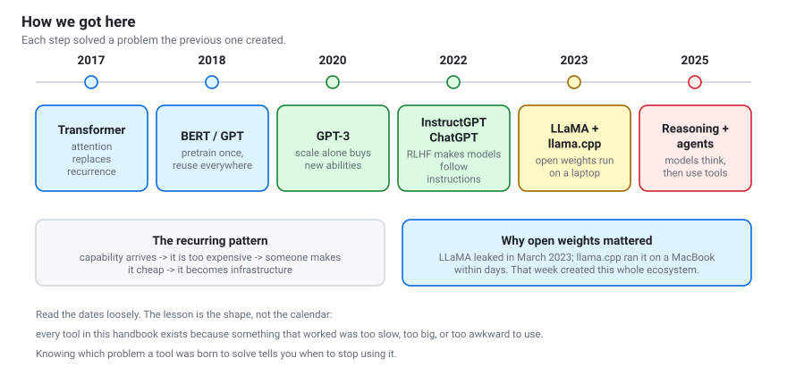

# How we got here
{: .no_toc }

The shortest history that actually explains the tools you will use.

1. TOC
{:toc}

---

## Why bother with history?

Because **every tool in this field was built to fix a specific, nameable
problem**, and if you know the problem you know when the tool stops being the
right answer.

LangChain looks strange until you know what writing an LLM app looked like in
2022. GGUF looks like pointless format proliferation until you know that no
consumer machine could load a 13B model in 2023. MCP looks like bureaucracy
until you have written the same filesystem integration for the fourth client.

## Before 2017: the recurrence bottleneck

Language models existed for decades — n-grams, then recurrent neural networks
(RNNs, LSTMs). They shared one crippling property: **they processed text one
word at a time, in order.** Word 500 could not be computed until word 499 was
done.

Two consequences:

- **Training was slow**, because you could not use a GPU's parallelism properly.
- **Long-range memory was poor.** Information from word 5 had to survive 495
  sequential updates to influence word 500. Usually it did not.

## 2017: the transformer

[*Attention Is All You Need*](https://arxiv.org/abs/1706.03762) removed the
recurrence. Instead of passing information along a chain, **every position looks
directly at every other position** through attention.

- Training parallelises across the whole sequence — GPUs are finally used well.
- Any token can reach any other in one step, so long-range dependencies survive.

The cost: comparing every token with every other is **quadratic**. That single
fact is why context windows are expensive, why the KV cache matters, and why a
decade of research has gone into making attention cheaper.

## 2018–2019: pretrain once, reuse everywhere

BERT and GPT established the pattern that defines the field: **train one large
model on enormous unlabelled text, then adapt it to many tasks.**

Before this, each task needed its own labelled dataset and its own model.
Afterwards, one expensive artefact served everything. This is the idea later
named a *foundation model*.

**What it created:** Hugging Face `transformers`, which exists because suddenly
everyone needed to download, load and fine-tune other people's pretrained
models, and every research group had invented a different file layout.

## 2020: scale, and the surprise

GPT-3 had 175 billion parameters — roughly 100× its predecessor. The surprising
result was not that it was better. It was that it could do things **nobody
trained it to do**: translate, write code, do arithmetic, follow an instruction
given three examples in the prompt.

This produced two lasting ideas:

- **Scaling laws.** Performance improves predictably with model size, data and
  compute. You can forecast a model's quality before training it.
- **Prompting as programming.** If the behaviour is already in the model, you
  elicit it with words rather than gradient descent.

It also produced a problem: a 175B model is unusable by almost everyone. Every
efficiency technique in this handbook descends from that problem.

## 2022: making models *want* to help

GPT-3 was powerful and unpleasant to use. Ask it a question and it might
continue with more questions — it was trained to continue text, not to answer.

[InstructGPT](https://arxiv.org/abs/2203.02155) fixed this with **RLHF**:
collect human preferences between model outputs, train a reward model, optimise
the model against it. ChatGPT followed months later and made the field
mainstream.

**The crucial lesson:** the capability was already in the base model. What
changed was its *disposition*. This is exactly why chapter 3 separates
pre-training (knowledge) from post-training (behaviour) so firmly.

## 2023: the weights get out

Meta released LLaMA to researchers in February 2023. It leaked within a week.

What happened next was extraordinary. Georgi Gerganov wrote
[llama.cpp](https://github.com/ggml-org/llama.cpp) — a C++ implementation that
ran the model on a MacBook by quantizing weights to 4 bits. Within weeks:

- **Quantization** went from a research topic to a default.
- **GGUF** appeared as a single-file format for quantized models.
- **Ollama**, **LM Studio** and others wrapped it in something usable.
- **LoRA** made fine-tuning affordable on one consumer GPU.
- **vLLM** made serving efficient enough for real applications.

Almost every tool in chapter 5 was created in or shortly after this window. It
is the single most important year for the material in this workshop, because it
is the year running a capable model on your own machine became normal.

## 2023–2024: making models useful, not just fluent

The models could talk. Making them *reliable* took a different set of ideas:

- **RAG** — give the model the documents instead of hoping it memorised them.
- **Tool calling** — let it use a calculator instead of guessing at arithmetic.
- **Structured output** — constrain generation so the result parses.
- **DPO** and relatives — get RLHF's benefit without RLHF's instability.
- **Mixture of Experts** — more parameters without proportionally more compute.

Frameworks proliferated wildly here. LangChain, LlamaIndex, Haystack, DSPy and
dozens more appeared to orchestrate these patterns. Many were thin, many were
abandoned, and a good number of teams discovered that the framework was larger
than the problem.

## 2024–2025: thinking, and agents

Two shifts closed the loop:

**Reasoning models.** Instead of answering immediately, models generate a long
internal chain of reasoning first. Crucially, this is trained with
**reinforcement learning against automatically checkable answers** — maths with
a known result, code that passes tests. No human labelling, so it scales.
Qwen3's thinking mode is this idea.

**Agents and protocols.** Once a model can reliably call tools, the loop in
notebook 10 becomes possible. And once many clients need many tools, you get
**MCP** — a standard so each integration is written once rather than once per
client.

## The pattern worth remembering

> A capability arrives, and is too expensive.
> Someone makes it cheap.
> It becomes infrastructure, and the next capability is built on top.

Attention made training parallel. Scale made capability emerge. RLHF made it
usable. Quantization made it local. Tools made it reliable. Protocols made it
composable.

**Each tool you are about to meet is one step in that chain.** When you evaluate
a new library, the useful question is not "is this popular?" but *"which step is
this, and do I have that problem?"*

---

**Next:** [How models work](how-models-work.html) — the mechanism underneath all of it.
