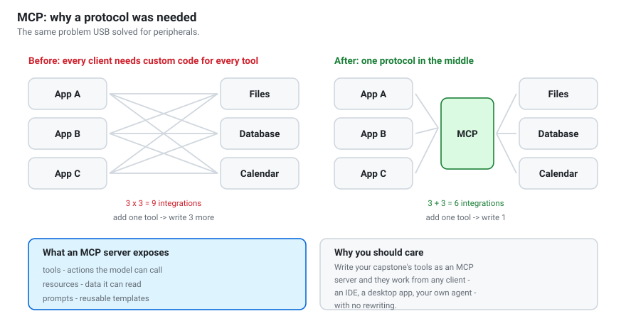

# Protocols and standards
{: .no_toc }

The interfaces that let models, runtimes and tools be swapped without rewriting
everything. Including MCP, in depth.

1. TOC
{:toc}

---

## Why protocols decide what is possible

A protocol is an agreement about message shapes. That sounds dull, and it is the
reason you can develop against Ollama on a laptop and deploy against vLLM on a
server by changing one string.

The pattern repeats through computing history: **N×M integrations collapse to
N+M once something standard sits in the middle.** Every protocol below is an
instance of that.

---

## The OpenAI chat-completions API

### The problem it solved

By early 2023 every model had its own Python API and its own request shape.
Switching model meant rewriting your application. Supporting two meant
maintaining two code paths.

### What happened

OpenAI's API was widely adopted first, so **everyone else implemented it**. Not
by committee — by gravity. Today vLLM, Ollama, llama.cpp, LM Studio, TGI,
Together, Groq, Fireworks and most others expose the same endpoints.

### The shape

```python
POST /v1/chat/completions
{
  "model": "qwen3:0.6b",
  "messages": [
    {"role": "system",    "content": "You are concise."},
    {"role": "user",      "content": "Why run a model locally?"}
  ],
  "temperature": 0.7,
  "max_tokens": 200,
  "tools": [ ... ],
  "stream": false
}
```

Roles: `system` (behaviour), `user`, `assistant`, `tool` (results you feed
back). `/v1/models` lists what is available and doubles as a health check;
`/v1/embeddings` covers embedding models.

### What this buys you

```python
client = OpenAI(
    base_url=os.environ.get("LLM_BASE_URL", "http://localhost:11434/v1"),
    api_key=os.environ.get("LLM_API_KEY", "not-needed"),
)
```

One environment variable moves you between your laptop, a lab server and a
hosted provider. **Never write application code against a specific model's
Python API** — put this interface in the middle and stay free to change your
mind. (Notebook 06.)

### Where the abstraction leaks

It is a de facto standard, not a specification, so the edges differ:

| Feature | Reality |
|---|---|
| Thinking mode | vLLM: `chat_template_kwargs`; Ollama: `think`. Set both. |
| Structured output | `response_format`, `guided_json` or `format` depending on server |
| Tool calling | vLLM needs `--enable-auto-tool-choice --tool-call-parser hermes` |
| Token counting | `usage` is often absent when streaming |
| Sampling extras | `min_p`, `repetition_penalty` are widely but not universally supported |

The workshop's `qwen_workshop.client` module papers over exactly these, which is
a reasonable model for your own code: keep the portable core, isolate the
differences.

---

## Tool-calling formats

### The problem

A model can only call a function if it knows the function exists, its arguments
and their types — and it must emit the call in a shape you can parse reliably.

### The schema

The OpenAI **function schema** became the common description format:

```json
{
  "type": "function",
  "function": {
    "name": "get_weather",
    "description": "Get today's weather for a city.",
    "parameters": {
      "type": "object",
      "properties": {
        "city": {"type": "string", "description": "City name, e.g. \"Astana\"."},
        "unit": {"type": "string", "enum": ["celsius", "fahrenheit"]}
      },
      "required": ["city"]
    }
  }
}
```

This is plain **JSON Schema**, which is why `enum` constraints work and why
Pydantic can generate it for you. It is also, in effect, a prompt: **the model
chooses tools by reading these descriptions**, so a vague description produces
vague tool use.

### What goes over the wire

Qwen3 emits Hermes-style blocks in its raw output:

```
<tool_call>
{"name": "get_weather", "arguments": {"city": "Astana"}}
</tool_call>
```

The server's **tool parser** converts that into a structured `tool_calls` field.
Different families use different markers — which is why servers need a
`--tool-call-parser` setting and why that flag is easy to forget.

### The part that matters for security

The model **emits a request**. Your code decides whether to honour it and then
executes it.


Every safety property lives in that decision. See
[privacy and safety](../guides/privacy-and-safety.html) and notebook 07.

---

## MCP — the Model Context Protocol



### The problem

Function calling standardised how a model *describes* a tool. It said nothing
about how a tool is **delivered** to a client.

So every client re-implemented everything. A filesystem integration for your
agent did not work in an IDE, a desktop app, or a colleague's framework. Three
clients and three tools meant nine integrations, and adding one tool meant
writing three more.

### The idea

Anthropic released MCP in late 2024 as an open protocol. Put one standard
interface in the middle:

- an **MCP server** exposes capabilities,
- an **MCP client** (any AI application) consumes them,
- they speak JSON-RPC over stdio or HTTP.

Three clients and three tools become six integrations, and each new tool needs
exactly one. It is the USB analogy, and it holds.

### What a server exposes

| Primitive | What it is | Example |
|---|---|---|
| **Tools** | actions the model can invoke | `create_issue`, `run_query` |
| **Resources** | data the client can read | a file, a table, a page |
| **Prompts** | reusable templates the user can pick | "review this diff" |

The separation matters. **Tools are model-controlled** — the model decides to
call them. **Resources are application-controlled** — the client decides what to
put in context. **Prompts are user-controlled**. Conflating these is the usual
design error.

### Roughly what a server looks like

```python
from mcp.server.fastmcp import FastMCP

mcp = FastMCP("notes")

@mcp.tool()
def search_notes(query: str, max_results: int = 5) -> list[dict]:
    """Search the user's personal notes for a keyword.

    Args:
        query: Word or phrase to look for.
        max_results: Maximum matching lines to return.
    """
    ...

if __name__ == "__main__":
    mcp.run()
```

If that looks almost identical to the `@tool` decorator in
`src/qwen_workshop/tools.py`, that is the point: the schema comes from type
hints and the docstring either way. **The difference is distribution, not
authoring.** Your capstone's tools can become an MCP server in an afternoon, and
then work from any MCP-capable client without rewriting.

### Transports

| Transport | Use |
|---|---|
| **stdio** | server runs as a local subprocess — the common case for local tools |
| **HTTP** | remote servers, shared across users |

stdio is a good default for personal tools: no ports, no auth, and the server
lives and dies with the client.

### Security — read this before exposing anything

MCP moves the integration problem, not the trust problem.

- **A server runs with your privileges.** An MCP server that can read your home
  directory gives that reach to any client you connect it to.
- **Installing a third-party server is running third-party code.** Treat it like
  any dependency: read it, or do not run it.
- **Tool descriptions enter the model's context**, so a malicious server can
  attempt prompt injection through its own metadata.
- **Least privilege still applies.** Scope a filesystem server to one directory.
  Give a database server a read-only role.

Everything in [the agentic AI guide](../guides/agentic-ai.html#3-tools-the-agents-hands)
about safe tools applies unchanged — MCP changes the packaging, not the risk.

### Should you use it?

| Use MCP when | Skip it when |
|---|---|
| Several clients need the same tools | One app, a handful of tools |
| You want to publish tools for others | It is coursework with a deadline |
| You use an MCP-capable client already | You are still learning the agent loop |

For the capstone: **write plain functions first**. Convert to MCP afterwards if
you want the tools to outlive the project. That order keeps the learning in the
loop, where it belongs.

---

## Other standards worth knowing

**OpenAPI** — describes REST APIs in JSON Schema. Several frameworks convert an
OpenAPI spec into tool definitions automatically, which is often the fastest
route to giving an agent access to an existing service.

**JSON Schema** — the shared backbone under function schemas, structured output
and MCP. Worth an hour of your time; it pays off across all three.

**OpenTelemetry** — vendor-neutral tracing. Emitting OTel spans from your agent
means any observability backend can read them, rather than locking your traces
into one vendor.

**GGUF** — a format rather than a protocol, but it plays the same role: one file
layout that many runtimes read.

---

## The through-line

Every protocol in this chapter exists for the same reason:

> Without a standard interface, **N** producers and **M** consumers need
> **N × M** integrations. With one, they need **N + M**.

- The **OpenAI API** did it for models and applications.
- **Function schemas** did it for models and functions.
- **MCP** did it for tools and clients.
- **GGUF** did it for weights and runtimes.

When you design your own system, the same question applies: *what am I putting
in the middle, and how many rewrites does it save?*

---

**You have reached the end of the handbook.** For where to take this next, see
[Where next](../guides/where-next.html). To start building, open
[notebook 01](https://colab.research.google.com/github/berdakh/ROBT613/blob/master/notebooks/01_llm_foundations.ipynb).
