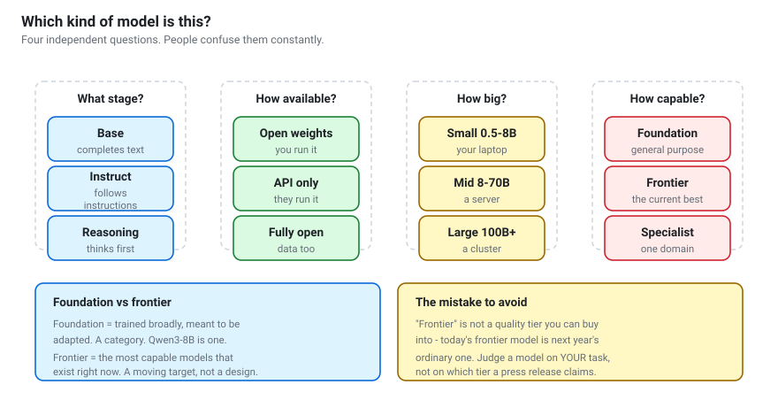

# The model landscape
{: .no_toc }

Base, instruct, reasoning. Foundation, frontier, specialist. Open weights, open
source. How to tell them apart and how to read a model card.

1. TOC
{:toc}

---



These are **four independent questions**. A model has an answer to each, and
people constantly collapse them into one vague notion of "how good is it".

---

## 1. What training stage is it?

| Type | What it does | Name looks like |
|---|---|---|
| **Base** | continues text | `Qwen3-8B-Base`, `-pt` |
| **Instruct / Chat** | follows instructions | `Qwen3-8B`, `-Instruct`, `-it` |
| **Reasoning** | thinks before answering | `-Thinking`, `R1`, o-series |
| **Specialist** | one domain | `-Coder`, `-Math`, `-VL` |

{: .warning }
> **Base models are not chat models.** No chat template, no instruction
> following. Downloading one by accident and concluding "this model is broken"
> is a rite of passage. Check the name.

**Reasoning models** cost 5–20× more tokens per answer and are worth it for
maths, logic, planning and code that must be right first time. They are waste
for translation, classification and formatting. Some models (Qwen3's hybrid
checkpoints) let you toggle it per request; others ship as separate
thinking/non-thinking releases.

---

## 2. How available is it?

| Tier | You get | Examples |
|---|---|---|
| **Fully open** | weights + data + training code | OLMo, Pythia |
| **Open weights** | weights, licence-permitting | Qwen, Llama, Mistral, Gemma, DeepSeek |
| **API only** | an endpoint | GPT, Claude, Gemini |

Almost everything called "open" is **open weights**: you get the trained
artefact, not the recipe. See
[the open-weight models guide](../guides/open-weight-models.html) for the full
treatment, including licences — which vary within a single family and are the
one thing you genuinely must check before building on a model.

---

## 3. How big is it?

| Size | Runs on | Realistically good at |
|---|---|---|
| **0.5–2B** | any laptop | format conversion, classification, learning the mechanics |
| **3–8B** | a laptop or modest GPU | RAG, tool calling, most workshop tasks |
| **14–32B** | a serious GPU | multi-step agents, harder reasoning |
| **70B+** | a cluster, or MoE tricks | close to frontier on many tasks |

Two things that break the naive size ordering:

- **Mixture of Experts.** Qwen3-30B-A3B has 30B parameters but activates ~3B per
  token. Memory of a large model, speed of a small one.
- **Training budget.** A small model trained on far more tokens beats an older
  larger one. Size alone is not capability.

**A bigger model at int4 usually beats a smaller model at int8** for the same
file size — a rule worth internalising before you pick a download.

---

## 4. How capable is it — foundation vs frontier?

These two words are used loosely and mean genuinely different things.

**Foundation model** — a *category*. Coined by Stanford in
[2021](https://arxiv.org/abs/2108.07258): a model trained broadly on large data,
intended to be **adapted** to many downstream tasks rather than used as-is.
Qwen3-8B is a foundation model. So is a 0.6B one. It says nothing about quality.

**Frontier model** — a *moving position*. The most capable models in existence
at a given moment. It is mostly used in policy and safety contexts, and today's
frontier model is next year's ordinary one.

| | Foundation | Frontier |
|---|---|---|
| What it describes | design intent | current standing |
| Stable over time? | yes | no |
| Can a 0.6B model be one? | yes | no |
| Useful for choosing a model? | somewhat | almost never |

{: .note }
> "Frontier" is not a quality tier you can purchase into. When a press release
> calls something frontier-class, it is a marketing claim about a leaderboard
> position, not a property you can rely on for your task.

**Other terms you will meet:** *SOTA* (best benchmark score, gameable),
*general-purpose* vs *specialist*, and *small language model* (SLM), which
usually just means "runs on your hardware".

---

## How to read a model card

The model card is the only authoritative source. Blog posts and tutorials —
including this one — go stale. Read these, in order:

1. **Licence.** Not the README prose: the `LICENSE` file. Commercial use
   permitted? Conditions? **Licences differ between sizes in the same family.**
2. **Model type.** Base or instruct? Size? MoE?
3. **Context length.** And whether the card distinguishes trained length from
   extended length.
4. **Recommended sampling settings.** Usually in the card or
   `generation_config.json`. Using the wrong ones is the most common cause of
   bad output.
5. **Chat template.** Does it support tools? A thinking toggle?
6. **Training data description.** Vague is normal. Absent is a warning.
7. **Limitations.** A card that admits none was written by marketing.
8. **Files.** Prefer `.safetensors`. A repo offering only `.bin` deserves
   suspicion — that format is a pickle and executes code on load.

### Judging a repo

- **The organisation.** `Qwen/Qwen3-8B` is official.
  `someuser/Qwen3-8B-v2-BEST-UNCENSORED` is not.
- **Downloads** — a rough proxy for "someone has verified this loads".
- **The community tab** — where people report that it is broken.
- **File sizes** that match the parameter count and precision. A "70B" repo of
  4 GB is a quantized copy, a LoRA adapter, or something wrong.

---

## Naming conventions, decoded

```
Qwen3-8B                 family, generation, size · instruct by default
Qwen3-8B-Base            pretrained only - NOT a chat model
Qwen3-30B-A3B            MoE: 30B total, 3B active per token
Qwen3-8B-Instruct-2507   dated release; the 2507 line split thinking out
Qwen3-8B-GGUF            quantized, for llama.cpp / Ollama
Qwen3-8B-AWQ             4-bit for GPU serving
Qwen3-Embedding-0.6B     embeddings, not generation
Qwen3-Reranker-0.6B      scores query/document relevance
Qwen2.5-Coder-7B         specialist
Qwen3-VL                 vision-language
```

Across other families: `-it` (Gemma) and `-Instruct` (Llama, Qwen) both mean
instruction-tuned; `-pt` means pretrained/base.

---

## Choosing, practically

Work down this list:

1. **What is the task?** Classification needs far less than open-ended agents.
2. **What hardware do you have?** This eliminates most options immediately.
3. **What licence do you need?** Eliminates more.
4. **Start one size smaller than you think.** Debugging a 0.6B model takes
   seconds per iteration; a 14B takes minutes. Scale up when you have evidence
   you need to.
5. **Test on ten of your own examples.** This beats every benchmark table.

> Notebook 02 implements steps 2 and 4 as code that inspects your machine and
> recommends a starting model.

---

## Staying current without drowning

The lineup changes every few months. Habits that survive:

- **Read model cards and technical reports**, not announcements.
- **Treat leaderboards sceptically.** Benchmarks leak into training data;
  human-preference arenas reward style as much as substance.
- **Keep a personal eval set.** Ten to twenty examples from your real task, in a
  file. Run every candidate model against it. This is the single highest-value
  habit in the whole field, and almost nobody does it.

---

**Next:** [The tool ecosystem](the-tool-ecosystem.html) — what all these
libraries are for.
