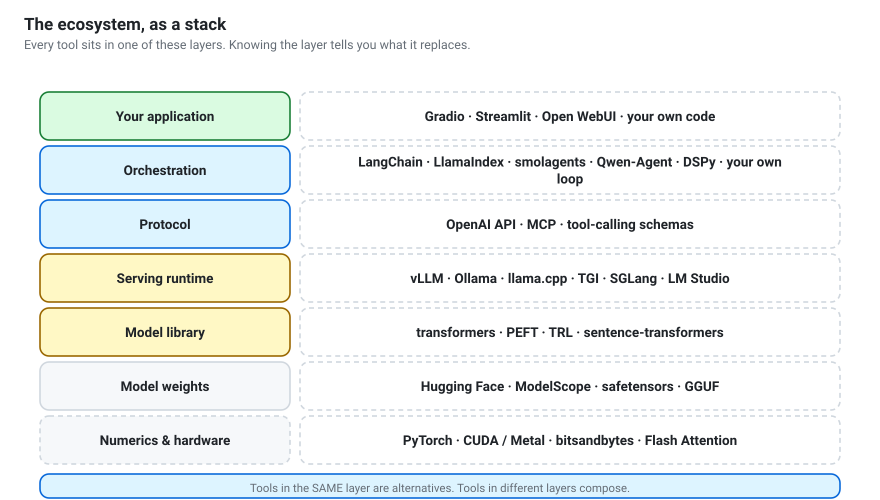
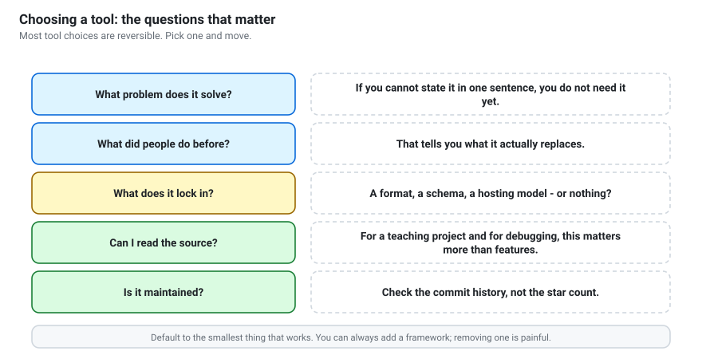

# The tool ecosystem
{: .no_toc }

Every tool worth knowing: what problem it solves, why someone built it, and
when *not* to use it.

1. TOC
{:toc}

---



## Read this first

The single most useful idea in this chapter:

> **Tools in the same layer are alternatives. Tools in different layers
> compose.**

vLLM and Ollama are alternatives — you pick one. vLLM and LangChain are not;
they stack. Most confusion ("should I use LangChain or Ollama?") dissolves once
you place a tool in its layer.

Second most useful idea: **every tool here was built because something specific
was painful.** The entries below lead with that pain, because it tells you when
the tool stops being the answer.

---

## Layer 1 — Numerics and hardware

### PyTorch
**Problem:** doing tensor maths on GPUs from Python without writing CUDA.
**Why it won:** define-by-run made debugging feel like normal Python, and
research went where debugging was tolerable.
**You use it:** indirectly, always. Everything above is built on it.

### CUDA / Metal / ROCm
GPU programming platforms. CUDA (NVIDIA) is the default and the reason NVIDIA
dominates; Metal is Apple Silicon; ROCm is AMD's, improving but still the
harder road.

### Flash Attention
**Problem:** naive attention writes an enormous intermediate matrix to GPU
memory, and memory bandwidth — not arithmetic — is the bottleneck.
**Solution:** restructure the computation so it never materialises that matrix.
Same mathematics, several times faster, much less memory.
**You use it:** by passing `attn_implementation="flash_attention_2"` when
available. This is the kind of tool you should know exists and otherwise ignore.

### bitsandbytes
**Problem:** a 16 GB model on an 8 GB GPU.
**Solution:** load weights in 8-bit or 4-bit, dequantizing per operation.
**When not to:** CPU or Apple Silicon — use GGUF instead. (Notebook 05.)

---

## Layer 2 — Weights and formats

### Hugging Face Hub
**Problem:** in 2019 every lab shipped weights in its own layout, on its own
server, with its own loading script.
**Solution:** one hub, one layout, versioned like git, with a `LICENSE` and a
model card.
**Note:** it is now also infrastructure for datasets, demos and inference —
which is a lot of centralisation for an ecosystem that prizes independence.

### ModelScope
Alibaba's equivalent, substantially faster inside mainland China. Same models,
different CDN.

### safetensors
**Problem:** PyTorch `.bin` files are Python pickles, and **loading one executes
arbitrary code** from whoever uploaded it. A model download was a supply-chain
risk.
**Solution:** a format that is pure data, with fast memory-mapped loading as a
bonus.
**Rule:** prefer `.safetensors`, always. Treat a `.bin`-only repo as suspect.

### GGUF
**Problem:** the PyTorch stack is heavy, GPU-centric and awkward for laptops.
**Solution:** a single self-contained file — weights, tokenizer, metadata, chat
template — designed for CPU and Apple Silicon inference, with quantization
built in.
**You meet it as:** `Qwen3-8B-Q4_K_M.gguf`. `Q4` = 4-bit, `K` = k-quants,
`M` = medium variant. Start at `Q4_K_M`.

### AWQ / GPTQ
Quantization schemes for **GPU** serving, using a calibration dataset to decide
which weights tolerate precision loss. Use these with vLLM; use GGUF with
llama.cpp.

---

## Layer 3 — Model libraries

### transformers (Hugging Face)
**Problem:** every architecture had a different codebase, so trying a new model
meant learning a new API.
**Solution:** one API — `AutoModel.from_pretrained(...)` — across hundreds of
architectures.
**Use it for:** experimentation, fine-tuning, anything research-shaped.
**Not for:** production serving. It handles one request at a time and is slow
by the standards of a real server.

### PEFT
**Problem:** full fine-tuning needs ~96 GB for an 8B model.
**Solution:** LoRA and friends — train under 1% of the parameters, produce a
few-megabyte adapter. (Notebook 11.)

### TRL
**Problem:** implementing SFT and preference optimisation correctly is fiddly,
and the details matter.
**Solution:** `SFTTrainer`, `DPOTrainer` and relatives, sharing the
`transformers` training loop.

### Unsloth / Axolotl
**Unsloth** rewrites the hot paths for roughly 2× faster LoRA on one GPU.
**Axolotl** is a YAML-configured wrapper so you can run fine-tunes without
writing training code. Both are conveniences over PEFT/TRL — reach for them when
you are doing this repeatedly.

### DeepSpeed / FSDP
**Problem:** the model does not fit on one GPU, even for training.
**Solution:** shard weights, gradients and optimiser state across many GPUs.
Relevant when you are training something large — which, realistically, you are
not.

### sentence-transformers
**Problem:** a chat model gives you a vector per token; search needs one vector
per passage, and the pooling and normalisation details matter.
**Solution:** a clean API for embedding and reranking models. (Notebooks 08–09.)

---

## Layer 4 — Serving runtimes

This is where most "which tool?" questions actually live.

| Runtime | Built for | Strength | Weakness |
|---|---|---|---|
| **Ollama** | individuals | trivial setup, model manager, auto server | limited tuning |
| **llama.cpp** | CPU / Apple Silicon | speed without a GPU, quant control | more setup |
| **vLLM** | production GPU | very high throughput | needs a real GPU, Linux-first |
| **TGI** | production GPU | HF-native, mature | similar niche to vLLM |
| **SGLang** | structured workloads | fast structured output, prefix caching | newer |
| **LM Studio** | desktop users | GUI, model browser | not scriptable |
| **MLX** | Apple Silicon | native, efficient | Apple only |

### llama.cpp
**Problem:** in early 2023, running a capable model meant renting a GPU.
**Solution:** a dependency-free C++ implementation with aggressive quantization.
It ran LLaMA on a MacBook and, more than any other single project, created the
local-model ecosystem. Ollama and LM Studio are both built on it.

### Ollama
**Problem:** llama.cpp is excellent and has a lot of flags.
**Solution:** `ollama run qwen3:0.6b`. It manages downloads, picks a
quantization, and exposes an OpenAI-compatible server automatically.
**Trade-off:** it hides the details you may later need. Fine — the workshop
default, and you graduate to llama.cpp when you need control.

### vLLM
**Problem:** naive serving wastes most of the GPU. Requests are padded to the
same length and the KV cache is allocated for the worst case.
**Solution:** **PagedAttention** manages the KV cache in pages like virtual
memory, and **continuous batching** admits new requests mid-generation. Order-of-
magnitude throughput gains for concurrent users.
**Use it when:** serving a class, or an application. Not for one person on a
laptop.

---

## Layer 5 — Protocols

Covered in depth in [chapter 6](protocols-and-standards.html). In brief:

- **The OpenAI chat-completions API** became the de facto standard. Every
  runtime above speaks it, so your application code is portable.
- **Tool-calling schemas** — the JSON shape describing a callable function.
- **MCP** — a protocol for exposing tools to any client, so integrations are
  written once rather than once per client.

---

## Layer 6 — Orchestration

The most crowded, most churning, most over-adopted layer. Approach with
scepticism.

### LangChain
**Problem, in 2022:** every LLM app re-implemented the same plumbing — prompt
templates, chaining calls, parsing output, swapping providers, memory.
**Solution:** abstractions for all of it, plus integrations with everything.
**The criticism, fairly stated:** the abstractions were deep, the API churned,
and debugging meant reading through several layers to find one HTTP call. Many
teams found the framework larger than the problem.
**Use it when:** you need many integrations quickly. **Skip it when:** you can
write the loop — as you do in notebook 10.

### LangGraph
LangChain's answer to that criticism: define your application as an **explicit
state graph** with nodes and edges. Because the control flow is data, you can
inspect it, resume it and add human approval steps. A genuinely better fit for
agents than chains-of-chains.

### LlamaIndex
Started as GPT Index, focused on **document-heavy RAG**: ingestion from many
formats, chunking strategies, index structures, query engines. Stronger than
LangChain on retrieval, narrower elsewhere.

### smolagents
**Problem:** agent frameworks became too big to read.
**Solution:** a small, readable library from Hugging Face, notable for having
agents write **Python code** as their action rather than emitting JSON tool
calls — often more expressive, and requiring a sandbox.

### Qwen-Agent
Qwen's own framework: tool calling, MCP support and a code interpreter, built
around Qwen's chat template. The natural next step from this workshop's
hand-written loop.

### CrewAI / AutoGen
Multi-agent orchestration — role-playing agents that delegate to each other.
Genuinely useful for map-reduce over independent subtasks and for
generator/critic patterns. Often the wrong answer: see
[the agentic AI guide](../guides/agentic-ai.html#6-multi-agent-systems).

### DSPy
**Problem:** prompt engineering is manual, fragile and unmeasured.
**Solution:** declare the *signature* of each step and let DSPy **optimise the
prompts automatically** against a metric you define. Intellectually the most
interesting entry in this layer — it treats prompting as a compilation problem
rather than a craft.

{: .warning }
> **Write the loop yourself first.** Notebook 10's agent is about thirty lines.
> Once you have written it, every framework here is demystified, and you can
> judge whether a given abstraction is buying you anything.

---

## Layer 7 — Retrieval and storage

### FAISS
Meta's similarity-search library. Battle-tested, very fast, approximate indexes
for large collections. No persistence layer, no metadata filtering — it is a
library, not a database.

### Chroma / Qdrant / Weaviate / Milvus / LanceDB
Vector **databases**: persistence, metadata filtering, hybrid search, an API.
Chroma is the easiest start; Qdrant is a common production choice; LanceDB is
embedded and file-based.

### pgvector
Vector search inside PostgreSQL. **If you already run Postgres, start here** —
one system to operate, transactions, joins against your existing data.

{: .note }
> For under ~10,000 chunks, a NumPy array is genuinely the right tool: exact
> results, no dependencies, no index build. That is what notebook 08 uses. Reach
> for a vector database when you outgrow it, not before.

### BM25 (`rank_bm25`, Elasticsearch)
Classical keyword ranking. Still beats embeddings on exact identifiers, names
and rare terms — which is why production retrieval is almost always **hybrid**.

---

## Layer 8 — Structured output

### Pydantic
Not an LLM tool, but central to using one. Define a schema as a Python class;
get validation, helpful errors, and a JSON Schema you can hand to the model.
**Your schema is simultaneously documentation, prompt and runtime guarantee.**

### Outlines / XGrammar / llguidance
**Problem:** asking nicely for JSON gives you JSON *most* of the time.
**Solution:** constrain decoding — at each step, mask out tokens that could not
continue a valid document under the schema. Invalid output becomes
**impossible** rather than merely unlikely.
**You meet it as:** `response_format` / `guided_json` in vLLM, `format` in
Ollama. (Notebook 07.)

### Instructor
Wraps an LLM client so you get a validated Pydantic object back, with automatic
retries that feed validation errors to the model. A thin, well-judged
abstraction.

---

## Layer 9 — Evaluation and observability

The least fashionable layer and the one that most separates people who can ship
from people who can demo.

### lm-evaluation-harness
EleutherAI's standard runner for academic benchmarks. What leaderboard numbers
come from — and a good reminder of how easily those numbers are contaminated.

### Ragas
RAG-specific metrics: faithfulness, answer relevance, context precision and
recall. Decomposes "the answer was bad" into *which stage* was bad.

### Langfuse / Phoenix / OpenTelemetry
**Problem:** an agent made six model calls and four tool calls and produced
nonsense. Which step went wrong?
**Solution:** tracing — every call, its inputs, outputs, latency and cost, in a
timeline. **An agent you cannot trace is an agent you cannot debug**, which is
why `AgentRun.trace()` exists in this repository's own code.

### Weights & Biases / TensorBoard
Training-run tracking: loss curves, hyperparameters, artefacts. You will want
one the second time you fine-tune something.

---

## Layer 10 — Interfaces

### Gradio
**Problem:** demonstrating a model meant writing a web app.
**Solution:** a UI from a function signature in a few lines. `gr.ChatInterface`
gives you a full chat UI. (Notebook 12.)

### Streamlit
More general-purpose data-app framework. Better for dashboards, more code for
chat.

### Open WebUI
A full self-hosted ChatGPT-style interface over Ollama or any OpenAI-compatible
endpoint — conversation history, multiple models, users. The right answer when
you want to give a class a chat interface rather than build one.

### Chainlit
Chat UI aimed specifically at LLM apps, with tool-call and reasoning-step
visualisation built in.

---

## Choosing, without agonising



A workable default stack for a student project:

```
Interface        Gradio
Orchestration    your own loop  (notebook 10)
Protocol         OpenAI API
Runtime          Ollama  (or vLLM if you have a GPU)
Library          transformers · sentence-transformers
Retrieval        NumPy  (FAISS past ~10k chunks)
Structure        Pydantic + constrained decoding
Evaluation       your own test cases
```

Every element is replaceable without touching the others, because each sits in
its own layer. That is the point of thinking in layers.

**Default to the smallest thing that works.** Adding a framework later is easy;
removing one that has spread through your codebase is not.

---

**Next:** [Protocols and standards](protocols-and-standards.html) — the
interfaces that let all of this fit together.
