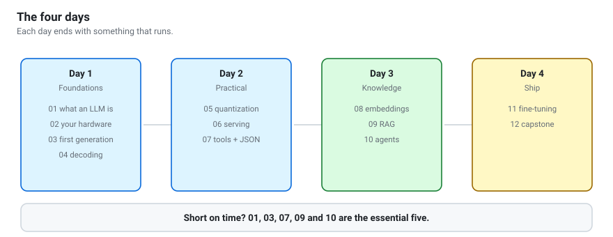

# Open-Weight LLMs & Agentic AI
{: .fs-9 }

A four-day, hands-on workshop. You will run Qwen models on your own hardware,
give them tools and your own documents, build an agent, measure whether it
works, and ship something you actually use.
{: .fs-6 .fw-300 }

[Start with Day 1](days/day-1.html){: .btn .btn-primary .mr-2 }
[Get the code](https://github.com/berdakh/ROBT613){: .btn }

---



## What you will be able to do

By the end of four days, without an API key and without an internet connection:

1. **Explain** what a language model computes, and why it behaves the way it does.
2. **Download and run** open-weight models on your own laptop, GPU or Colab.
3. **Choose** the right model size, quantization and runtime for given hardware.
4. **Get structured, validated output** that your program can rely on.
5. **Give the model tools** it can call, safely.
6. **Build retrieval** over your own notes, with citations and refusals.
7. **Write an agent loop** from scratch and debug it when it misbehaves.
8. **Fine-tune** a model with LoRA — and know when not to.
9. **Measure** all of the above instead of guessing.

## Prerequisites

You need comfortable Python (functions, classes, dicts, list comprehensions)
and the ability to use a terminal. You do **not** need machine-learning
background, a GPU, or any paid service.

| You have | You can do |
|---|---|
| Any laptop, 8 GB RAM | Everything, using Qwen3-0.6B / 1.7B |
| 16 GB RAM or Apple Silicon | Everything, comfortably, with Qwen3-4B |
| An NVIDIA GPU | Everything, plus fine-tuning and vLLM |
| None of the above | Everything, in free Google Colab |

## The four days

| Day | Theme | Notebooks | You end the day able to |
|:---|:---|:---|:---|
| [**1**](days/day-1.html) | Foundations & first run | 01–04 | Run a model locally and control its output |
| [**2**](days/day-2.html) | Making it practical | 05–07 | Serve it over an API and get trustworthy JSON |
| [**3**](days/day-3.html) | Knowledge & agents | 08–10 | Build RAG over your notes and an agent with tools |
| [**4**](days/day-4.html) | Adapt & ship | 11–12 | Fine-tune, evaluate, and present a capstone |

## Set up in five minutes

```bash
git clone https://github.com/berdakh/ROBT613.git
cd ROBT613
python -m venv .venv && source .venv/bin/activate   # Windows: .venv\Scripts\activate
pip install -r requirements.txt
python scripts/check_env.py
```

Then open `notebooks/01_llm_foundations.ipynb`.

**No install at all?** Every notebook has an *Open in Colab* badge — see [Run in Colab](guides/colab.html).

Full instructions, including Colab and Windows: [Setup](guides/setup.html).

## Background reading: the handbook

The notebooks teach you to build. [**The handbook**](handbook/) explains what
you are building on — and it stands alone, with no code to run.

| | Chapter |
|:---|:---|
| 1 | [How we got here](handbook/how-we-got-here.html) — why each piece was invented |
| 2 | [How models work](handbook/how-models-work.html) — tokens, attention, context |
| 3 | [How LLMs are trained](handbook/how-llms-are-trained.html) — every phase, from raw data to your fine-tune |
| 4 | [The model landscape](handbook/the-model-landscape.html) — base vs instruct, foundation vs frontier |
| 5 | [The tool ecosystem](handbook/the-tool-ecosystem.html) — every tool, and the problem it solves |
| 6 | [Protocols and standards](handbook/protocols-and-standards.html) — the OpenAI API, tool calling, MCP |

## Deep-dive guides

The notebooks are hands-on; these are the reference material behind them.

- [**Open-weight models**](guides/open-weight-models.html) — what "open weights"
  really means, licences, formats, where to get them, how to choose.
- [**The Qwen family**](guides/qwen-family.html) — which model for which job.
- [**Agentic AI**](guides/agentic-ai.html) — the long version: loops, planning,
  memory, multi-agent, MCP, evaluation, and how agents fail.
- [**Privacy and safety**](guides/privacy-and-safety.html) — running on your own
  data responsibly.
- [**Deployment**](guides/deployment.html) — from notebook to service.
- [**Troubleshooting**](guides/troubleshooting.html) — when it breaks.
- [**Cheat sheet**](guides/cheatsheet.html) — the commands and snippets you will
  actually reuse.
- [**Glossary**](guides/glossary.html) — every term, defined plainly.

## A note on honesty

Small open-weight models are **not** as capable as the largest hosted models.
This workshop does not pretend otherwise. What it teaches is how to close much
of that gap with retrieval, tools, structure and evaluation — and how to know,
with evidence, when you have not closed it.
